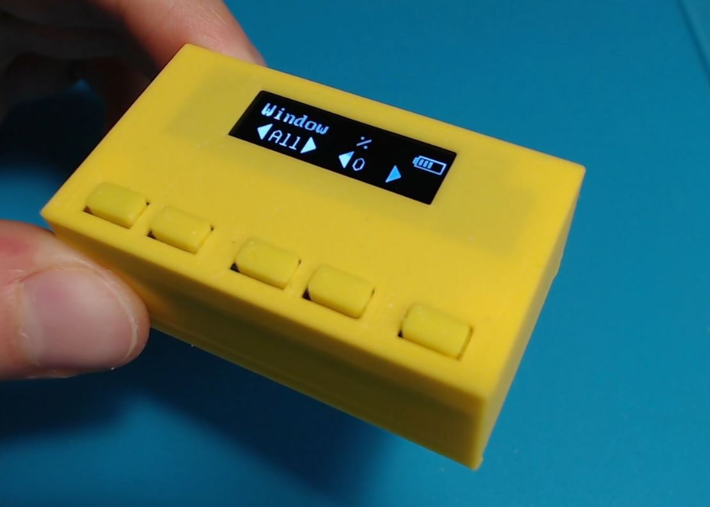

# Automatic roller blinds small remote
A small 30x50x20mm remote with 5 buttons, and an OLED screen. This project is used to control the  [automatic roller blinds motor](https://github.com/asafteirobert/automatic-roller-blinds-motor) project, but you are welcome to adapt the code for yourself; it can be used to control anything with a NRF24L01 module.
Built around an Arduino pro mini.

It has a battery life of a few months.

## How to use it

The remote is used to is used to control the  [automatic roller blinds motor](https://github.com/asafteirobert/automatic-roller-blinds-motor).

The remote will go into deep sleep after 15 seconds. Press any button to wake it up.

First, you will need to connect the remote to your blinds. To do this, hold the last button for 1 second to enter the menu. Select the room number(according to the `ROOM_NUMBER` you defined). Navigate to the "Discover" option. Make sure the remote is close to the blinds and simply press ok. The remote will scan of nearby blinds and remember those which have the same room number.

Next you will need to calibrate the blinds so they know what the maximum and minimum positions are. This can be a bit tedious but should be done carefully as not doing the calibration correctly can damage the blinds. Go to the menu and select "Calibrate". Use buttons 3 and 4 to move the blinds up and down. When the blind is in the top position, press button 1 to save it. When the blind is in the bottom position, press button 2 to save it. Press button 5 to move to the next window and repeat until all windows are calibrated. Now everything is set up and you can use the blinds.

On the main screen you can select the window you want to change, the percentage you want to change it to and, using the last button, confirm the change. An X or ✓  will be displayed depending if the command was sent successfully.

To save a preset, move the blinds to the desired positions, enter the menu, navigate to "Save preset", select the preset number you want to save and press ok. To load a preset, hold the corresponding button while on the main screen (hold the first button to load preset 1, etc).

## Limitations and known issues:
- The range on the NRF24L01 is pretty disappointing when inside a case and covered by a hand. The reliable range is generally limited to one room.
- The remote remembers the last position sent to the blinds and doesn't poll the status. This means that when the blinds are moved (using other remotes, the web interface or RESTful API) the percentage shown on the screen can be out of date.

## Making your own
All the required files are included in this project. This includes source code, 3D files to be 3D printed, schematic and PCB.
For instructions see [doc/assembly.md](doc/assembly.md).

## Project status: Finished, active
All intended functionality is implemented and manually tested. I will try to fix major bugs when they are reported. I will review pull requests, but generally I prefer if you fork the project in order to make your own changes and improvements.
