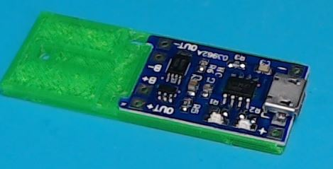

# Automatic roller blinds small remote assembly instructions

For this project you will need a 3D printer, patience, good soldering skills and some experience with Arduino and Platform IO.

Since I tried to make it cheap, simple, compact and using simple modules, it requires careful assembly.

## Materials
- Arduino Pro Mini 3v3
- 0805 5.1k SMD resistor
- 2x 0805 1uf SMD capacitor
- 2x 0805 4.7uf SMD capacitor
- 5x 3x4x2mm pushbuttons
- NRF24L01+	SMD module
- 1206 1k SMD resistor
- 1206 4k7 SMD resistor
- HT7333 SOT-89 LDO regulator
- OLED 0.91" 128X32 module
- TP4056 battery charging + protection module
- 601148 3.7V 380mAh LiPo battery. Dimensions are 6x11x48mm. [Example link](https://www.aliexpress.com/item/4001065299900.html)
- 3D printed parts found in `3d print` folder. 5x buttons and 1 of the rest.
- PCB
- 2x M2x5 screws

## The circuit board

The PCB needs to be 0.8mm thick(or similar).

You can find the schematic and PCB in the `schematic` folder. It contains an EasyEDA project and Gerber files.

Or simply order the it from this link: [https://www.pcbway.com/project/shareproject/](https://www.pcbway.com/project/shareproject/)

## Steps

1. On the TP4056 charging module, replace R3 with a 5.1k resistor. This will set set the charging current 235mA.
2. Remove R1 and R2 which connect to the LEDs. This will be necessary to connect the wires which will report the charging status to the Arduino.

3. Remove the regulator and LEDs from the Arduino. This is required for the low power battery operation
4. Remove the switch.

5. Open this project in Platform IO, compile and upload it. You will need a USB serial adapter. After assembly it will be difficult to access the programming pins. Alternatively, you can solder a small programming connector.
6. Solder the pin headers to the arduino. Make sure you have the correct number of pins. Make sure the pins are facing the side with the components. Because of the compact design, the pins can't protrude more than 1mm from the bottom side. If necessary, solder from the other side.

7. Solder the SMD components to the PCB. Note that the switches are very close to each other. Use double sided tape for the NRF24L01 module to make sure it doesn't touch the nearby pins.
8. Solder the Arduino to the PCB, upside down. Carefully align the Arduino and PCB so both boards are parallel and the distance between the boards is 6.5mm (including the board thickness)

9. Solder the OLED module. The spacing is very tight so I added some insulation to make sure these components don't touch. Add a spacer so the screen is secure and parallel to the board.

10. Solder a pair of wires to the power pins on the board and route them between the 2 boards

11. Solder 2 small wires to the A0 and A1 pins of the Arduino. They will be used to read the charge status of the TP4056 charging module.

13. Remove the protective film from the OLED and carefully place the board inside the case. Use M2x6 screws to secure the board.

12. Glue the TP4056 charging module to the "internal part" 3D printed part.

13. Glue the 3D printed part to the Arduino board. Make sure it's aligned correctly 

14. Solder the power wires to the output of the charging module.

15. Solder the charge status wires to the charging module. A0 is connected to the R2 pad coming from the IC, A1 is connected to the R1 pad coming from the IC.

16. Install and solder the battery.

18. Test that it works.
17. Close the cover, glue the cover if necessary, glue the 3D printed buttons.

